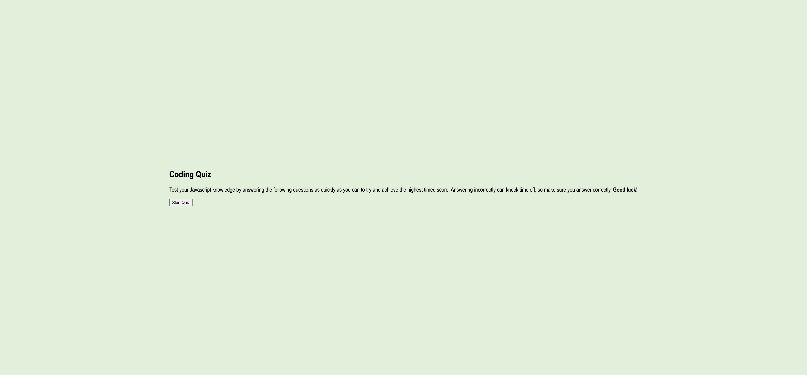

# 04 Web APIs: Code Quiz

## Description

Attempted to create a quiz using query selectors and other Web APIs to display 5 questions about Javascript. 

## Usage

User opt in to take a quiz where the more answers they answer correctly, the better their score is. If users select incorrect answers, time is deducted from the timer, resulting in a lower score. Users score is based on time left at the end of the quiz.

Users will enter their names at the end of the quiz and receive their "score" or time.

## Screenshot

Live URL: https://jennahopeclem.github.io/Web-APIs/ 

GitHub: https://github.com/jennahopeclem/Web-APIs